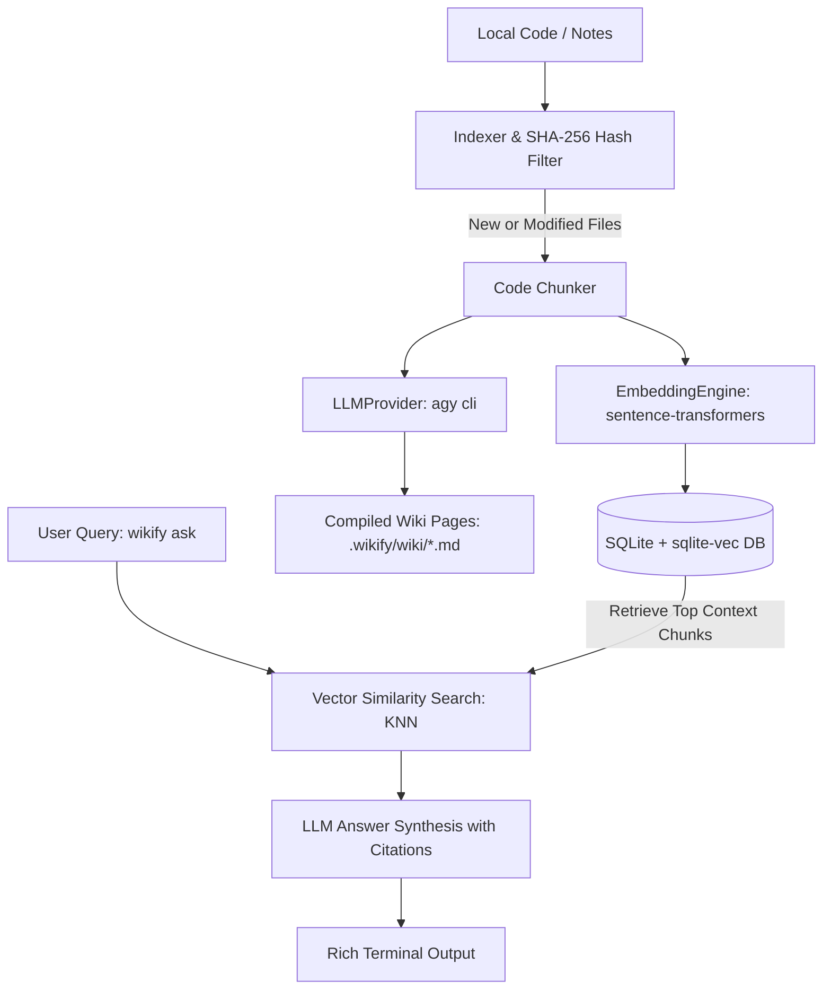

# 🚀 wikify (`llm-wiki-cli`)

> An autonomous CLI Agent that compiles local codebases and notes into an interlinked, searchable LLM Wiki powered by SQLite vector search (`sqlite-vec`) and local AI models.

Inspired by **Andrej Karpathy's LLM Wiki** concept.

---

## 🌟 Key Features

- **⚡ Incremental SHA-256 Indexing:** Calculates file hashes to only process modified/new files, saving time and compute.
- **🔍 SQLite Vector Search (`sqlite-vec`):** High-performance vector similarity search stored locally in a single `.wikify/knowledge.db` file.
- **🧠 Local HuggingFace Embeddings:** Uses `sentence-transformers` (`all-MiniLM-L6-v2`) for local 384-dimensional vector generation with zero API costs.
- **🤖 Decoupled LLM Provider:** Abstracted `LLMProvider` interface calling local `agy cli` via Python subprocesses.
- **🎨 Terminal UI Experience:** Built with `typer` and `rich` featuring interactive progress bars, spinners, and formatted Markdown output.
- **🧪 Test-Driven Development (TDD):** Fully covered by `pytest` unit & integration test suites.

---

## 🏗️ Architecture Overview



---

## 🛠️ Installation & Setup

```bash
# 1. Clone repository
git clone https://github.com/BingFengHung/llm-wiki-cli.git
cd llm-wiki-cli

# 2. Create virtual environment
python -m venv .venv
source .venv/bin/activate  # On Windows: .venv\Scripts\activate

# 3. Install in editable mode
pip install -e .
```

---

## ⚡ Command Usage

### 1. Sync & Compile Knowledge Base
```bash
wikify sync --path .
```
*Scans project files, computes SHA-256 hashes, generates vector embeddings, and compiles structured Wiki markdown entries under `.wikify/wiki/`.*

### 2. Query Codebase Knowledge
```bash
wikify ask "How does the database connection and vector search work?"
```
*Executes hybrid vector similarity search, synthesizes an answer using the local LLM Provider, and displays cited source files with distance scores.*

### 3. View Knowledge Base Status
```bash
wikify status
```
*Displays statistics including indexed file count, total code chunks, compiled wiki pages, and database size.*

---

## 🧪 Running Tests

```bash
pytest -v
```

---

## 📄 License

MIT © [BingFengHung](https://github.com/BingFengHung)
