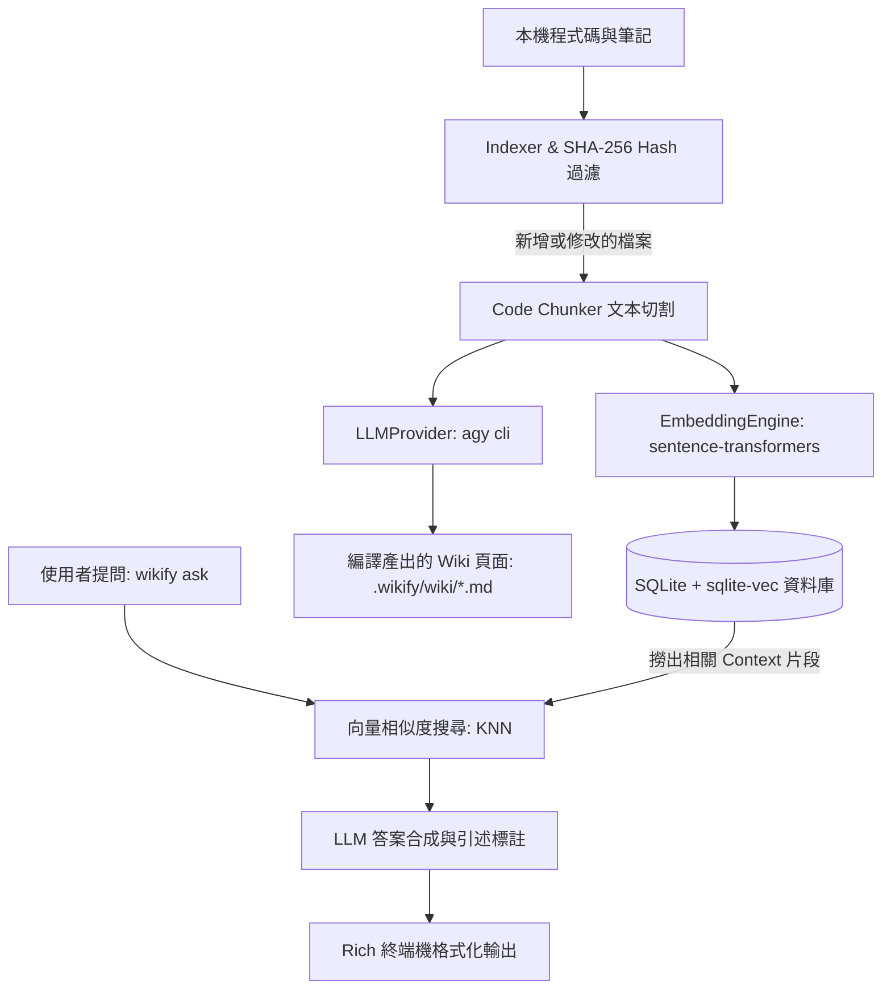

# 🚀 wikify (`llm-wiki-cli`)

[English](README.md) | [繁體中文](README_zh.md)

> 一款自主運作的本機 CLI Agent，能自動將本機程式碼庫與筆記「編譯」成互相連結、可檢索的 LLM Wiki，並結合 SQLite 向量搜尋 (`sqlite-vec`) 與本機 AI 模型。

本專案受 **Andrej Karpathy 的 LLM Wiki 概念** 啟發所開發。

---

## 🌟 核心特色

- **⚡ 增量 SHA-256 索引：** 計算檔案 Hash，僅處理新增或修改過的檔案，大幅節省時間與算力。
- **🔍 SQLite 向量搜尋 (`sqlite-vec`)：** 高效能向量相似度搜尋，所有資料完全儲存於本機單一 `.wikify/knowledge.db` 檔案中。
- **🧠 本地端 HuggingFace 向量模型：** 使用 `sentence-transformers` (`all-MiniLM-L6-v2`) 於本機 CPU 生成 384 維度向量，零 API 費用。
- **🤖 解耦的 LLM Provider：** 抽象化的 `LLMProvider` 介面，預設透過 Python subprocess 呼叫本機 `agy cli`。
- **🎨 頂級終端機 UI 體驗：** 基於 `typer` 與 `rich` 開發，支援互動式進度條、轉圈動畫與格式化 Markdown 輸出。
- **🧪 測試驅動開發 (TDD)：** 擁有完整的 `pytest` 單元與整合測試套件。

---

## 🏗️ 系統架構圖



---

## 🛠️ 安裝與設定

```bash
# 1. Clone 專案庫
git clone https://github.com/BingFengHung/llm-wiki-cli.git
cd llm-wiki-cli

# 2. 建立虛擬環境
python -m venv .venv
source .venv/bin/activate  # Windows 環境請執行: .venv\Scripts\activate

# 3. 以可編輯模式安裝
pip install -e .
```

---

## ⚡ CLI 指令使用說明

### 1. 同步與編譯知識庫 (Sync & Compile)
```bash
wikify sync --path .
```
*掃描專案檔案、計算 SHA-256 Hash、生成向量嵌入，並在 `.wikify/wiki/` 目錄下編譯結構化的 Wiki Markdown 頁面。*

### 2. 提問與程式碼檢索 (Ask)
```bash
wikify ask "這個專案的資料庫與向量搜尋是怎麼實作的？"
```
*執行向量相似度搜尋，透過本地 LLM 答案合成，並印出引述的來源檔案與相似度距離。*

### 3. 查看知識庫狀態 (Status)
```bash
wikify status
```
*顯示目前知識庫統計資訊（包含已索引檔案數、程式碼 Chunk 總數、編譯 Wiki 頁面數與資料庫大小）。*

---

## 🧪 執行測試

```bash
pytest -v
```

---

## 📄 授權條款

MIT © [BingFengHung](https://github.com/BingFengHung)
